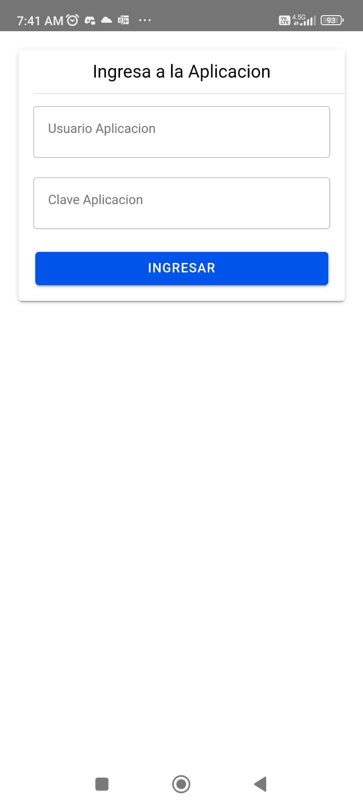
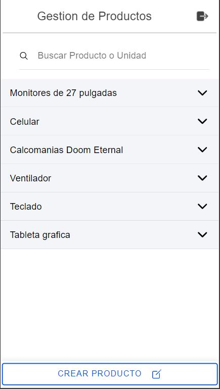
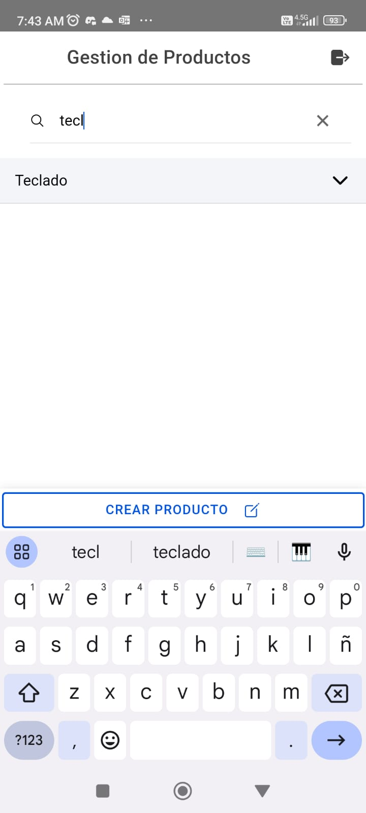
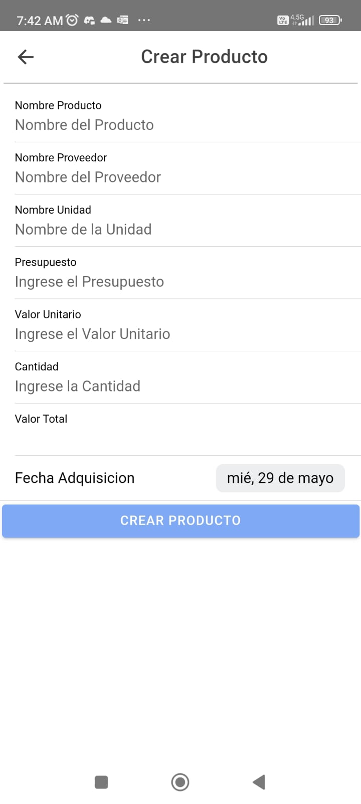
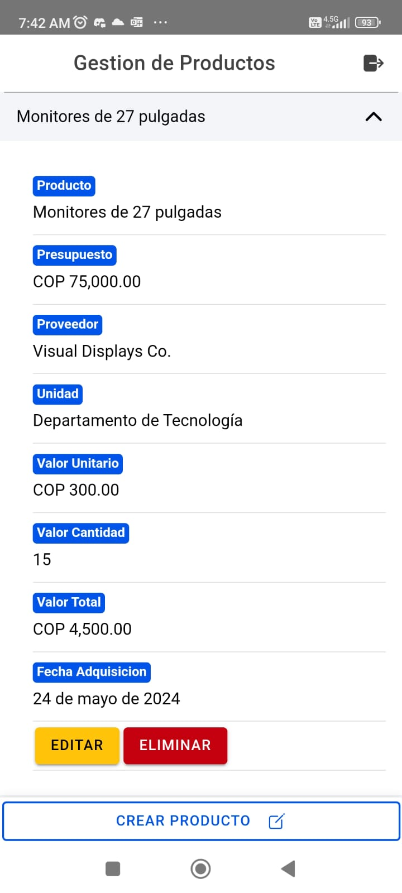
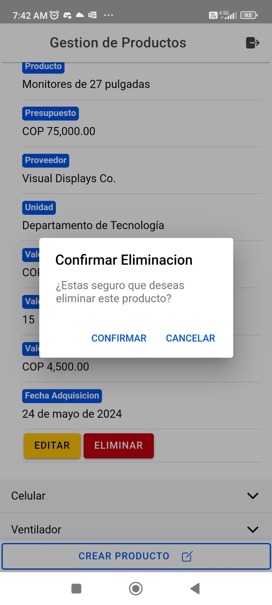
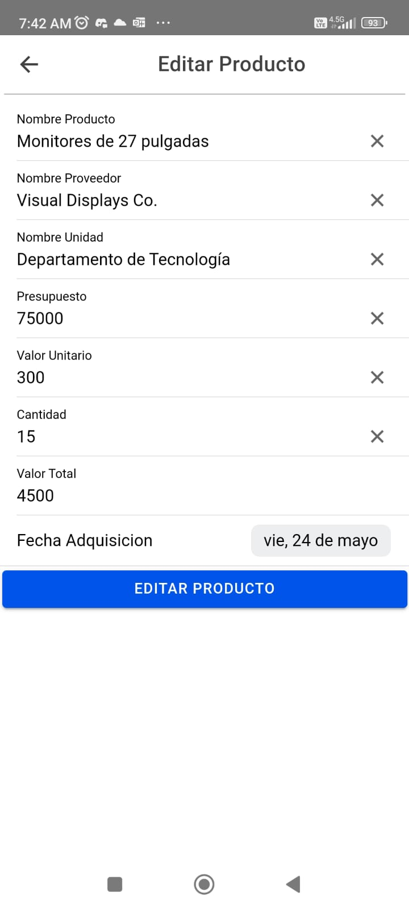

# Aplicación de gestión de productos iónicos

Esta aplicación fue desarrollada utilizando Ionic para gestionar productos simples. Proporciona funcionalidades para enumerar y realizar operaciones CRUD (Crear, Leer, Actualizar, Eliminar) en productos. La base de datos utilizada es un servicio de Firebase, concretamente Firestore. La aplicación también incluye autenticación, lo que permite a los usuarios iniciar sesión con un nombre de usuario y contraseña.

## Instalación

Para usar nuestro Proyecto debes usar git para descargar el repositorio:

```bash
  git clone https://github.com/Dabrox02/app-gestion-productos-ionic.git
```

También es necesario tener algunas dependencias para probar y ejecutar la aplicación a través de su código fuente.

### Primer paso:
Necesitas node y en este caso npm el administrador de paquetes.

Aquí os dejo un [link](https://kinsta.com/es/blog/como-instalar-node-js/) para instalar node en los diferentes sistemas operativos más comunes.

Instalar iónico:

```bash
    npm install -g @ionic/cli
```

Instalar angular:

```bash
    npm install -g @angular/cli
```

    
## Tecnoligas usadas:
- Firebase Authentication
- Firestore
- Ionic/Angular
- Typescript


## Documentación

Ok después de tener instalado lo necesario vamos a proceder a usarlo desde el código fuente en una computadora con lo anterior instalado.
El comando para ejecutar la operación de ejecución de la aplicación es:

```bash
    ionic serve
```

De forma predeterminada, la aplicación se ejecutará en http://localhost:8100

Esta imagen aparecerá donde se debe lograr:




Después de eso, aparecerá una lista de los productos. También arriba aparecerá un buscador de los productos por nombre.





También debajo está el botón agregar donde si hacemos clic en él nos aparecerá una interfaz para agregar el producto.




También tienes la opción de editar y eliminar productos específicos, estos aparecen como un botón en la información del producto:



Para eliminar, haga clic en la opción eliminar y aparecerá una alerta que le pedirá confirmación para eliminar el elemento:



Para editar aparecerá una interfaz similar a la de agregar el producto con los datos del producto para editarlo:



## Autores

- [johanp0308](https://github.com/johanp0308) Johan Sebastian Pachon Mojica
- [Dabrox02](https://github.com/Dabrox02) Jaider Stiven Mendoza Cardona
- [DarkConecta](https://github.com/DarkConecta) Marlon Alberto Sosa Garcia

